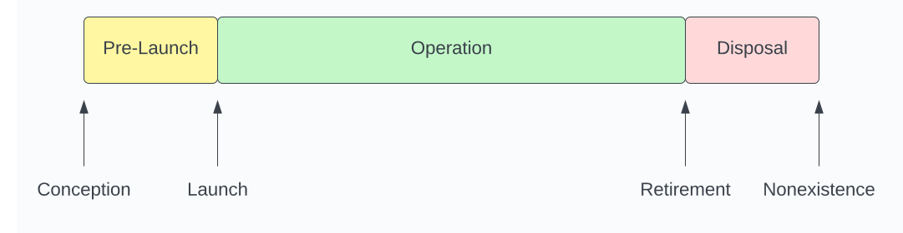

# System Life Cycle

See https://csrc.nist.gov/pubs/sp/800/160/v1/r1/final

**Note**: Do not differentiate between evolution, development, maintenance, etc... as they all have the same outcomes. The only differences are inputs to the decision to move an item through to implementation in the operation phase (or to not). All other activities and outcomes remain the same.

# Phases & Transitions

## Conception
The need for the system is conceived. See System Conception (TODO link) for more information.
## Pre-Launch (TODO need a better name)
Analysis, Design, and implementation of the initial system, up to the point where it is launched. See System Pre Launch (TODO link) for more information.
## Launch
The system is made available to the customer(s) in a "production" setting. See System Launch (TODO link) for more information.
## Operation
The continuous Identification, Planning, Implementation, and Review of items affecting the system. See System Operation (TODO link) for more information.
## Retirement
The system is no longer available to customer(s). See System Conception (TODO link) for more information.
## Disposal
The system is decommissioned and all systems, infrastructure, data, etc... is archived and/or removed.
## Nonexistence
The system no longer exists

# Items
Note that the use of the word "Item" within this section refers to the abstract item that flows through the life cycle and is identified at each step.

# Steps & Transitions

Each phase within the System Life Cycle is comprised of 4 distinct steps: Identify, Plan, Implement, Review. Each of these steps is meant to be completed sequentially for each item that identified, and it is expected that items will be recursively broken down into sub-items, where each sub-item (and its sub-items) will also flow through each of the 4 steps mentioned above. Also note that there is no requirement that a single "meta-item" or "root-item" be identified that all items must be tied to. These 4 steps and the methodology laid out here is intended to add structure and observability to the process, and it is not intended to suggest that this is a fully linear process proceeding once from Identify, Plan, Implement, and Review out to the next phase in the life cycle.

Please see System Steps (TODO link) for an in-depth description of each step.

## Identify
Identify, Classify, and Justify items that impact the system.
## Accepted
The item has been accepted and is moved to the plan step.
## Plan
Plan, Collaborate, and Prioritize accepted items.
## Scheduled
The item is scheduled and moved to the implement step.
## Implement
Implement, Verify, and Communicate scheduled items.
## Completed
The item is completed and moved to the review step.
## Review
Review, Validate, and Act on completed items.
## Done
The item is done.

# Prior Art

The scope of activities associated with a system, encompassing the system's initiation, development and acquisition, implementation, operation and maintenance, and ultimately its disposal. (https://csrc.nist.gov/glossary/term/system_development_life_cycle#:~:text=Definitions%3A,maintenance%2C%20and%20ultimately%20its%20disposal.)

SDLC is not a methodology per se, but rather a description of the phases that a methodology should address. The list of phases is not definitive, but typically includes planning, analysis, design, build, test, implement, and maintenance/support. (https://en.wikipedia.org/wiki/Systems_development_life_cycle#:~:text=SDLC%20is%20not%20a%20methodology,implement%2C%20and%20maintenance%2Fsupport.)