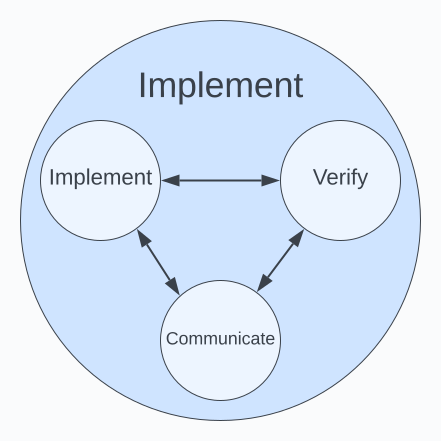

# Steps and Transitions
What follows is a description of each step and transition, including the major focus' and relevant activities and outcomes for each step, focus, and transition.

## Identify
Identify, Classify, and Justify items that impact the system.

This step focuses on identifying items that are required to transition this system through launch to the operation phase. 

### Identify
Identify items that impact the system and are required for launch. Items that are not required for launch should be moved to the operation phase and handled there.

> Note that a system is created to enable or support a product or process. The items identified in those life cycle steps should feed the requirements for items identified in this step.

> Note that organizational system requirements such as using approved architectures, languages, security methodologies, etc feed into the identification step.

> Note that a good place to identify and/or check for additional requirements is the System Launch Checklist.

> Note that this step does NOT specify _how_ the system should accomplish this. It should only identify _what_ the system should do from the perspective of the product or process that uses/relies on the system.

**Purpose**: To identify and describe _what_ the item is. to a degree sufficient that a justification of why this item should be addressed can be made and that a plan can be created to resolve this item.

**Outcome(s)**: Each item 1) is recorded within the team's item-tracking/ticketing system and 2) contains a description of the item sufficient so that a justification can be created and the item accepted and moved to the Plan step.

**Example(s)**:
* Item X - The system must support user authentication for product X as described in Product Features A, B, and C...
* Item Y - The system must accept an email and password combination and return an authentication token for use throughout the product.

### Classify
Classify the item.

> Note that you usually only need 3 types of items: Epic, Task, and Sub-Task. Epics are for larger bodies of work that aren't worked on individually and need to be broken up. Tasks are for a small enough set of work that can be assigned to an individual to complete in a reasonable amount of time. Sub-Tasks are for the individual to use to break up the work into a series of discrete steps, or to track work that is not contiguous by nature (i.e. after Sub-Task 1 is complete, we need to wait for 24 hours for X to propagate, and then we can work on Sub-Task 2)

**Purpose**: To classify the item so that type-specific requirements, activities, and artifacts can be tracked.

**Outcome(s)**: Each item 1) is assigned one of the approved System Item Types (TODO link).

**Example(s)**:
* Initiative
* Epic
* Task
* Sub-Task

### Justify
Justify the need to address the item.

> Note that in many cases a link to a product or process item or to an organizational policy can be a sufficient justification. The reason to record the justification of _why_ this item is needed is to add context and ensure focus on the overall organizational purpose, and not to create busy work.

**Purpose**: To justify _why_ the item as identified should be addressed by the team and prioritized for planning and implementation.

**Outcome(s)**: Each item 1) contains a justification of why this item needs to be completed with enough detail that the item can be accepted and moved to the Plan step.

**Example(s)**:
* See Product Item X
* See Policy Y section 1.3.b
* The system must cleanly handle the possible error states that may occur during implementation in a way that is both secure and properly communicates to the user what is occurring.

## Accept
Accept an identified item and begin planning on how to resolve it.

> Note that this is an explicit hook for the Org/Team to place controls on to ensure the item meets organizational standards as defined by the item type, system, etc. For example, if strategic approval is needed on larger items, this would be the place to introduce additional activities to ensure that items of a certain type are approved.

> Note that ideally, all of the controls needed for this transition can be automated and this acceptance transition is only needed to trigger said automated controls.

**Purpose**: To provide a control point to ensure that only items that are sufficiently identified, classified, and justified are moved to the planning step.

**Outcome(s)**: Each item 1) has been examined and all Identify Step outcomes have been completed and are sufficient for their intended purpose and 2) has been moved to the Plan step.

**Example(s)**:
* TODO

## Plan
Plan, Collaborate, and Prioritize

### Plan
Plan how to address the item.

**Purpose**: To formulate a plan of _how_ to address the identified item.

**Outcome(s)**: Each item 1) has a plan for _how_ to address the identified item. 

**Example(s)**:
* TODO

### Collaborate
Collaborate with others on the plan.

**Purpose**: To collaborate on the plan with _who_ needs to review/approve/know/etc.

**Outcome(s)**: Each item 1) has been collaborated on with everyone _who_ needs to review/approve/know/etc.

**Example(s)**:
* TODO

### Prioritize
Prioritize the timing of the plan.

**Purpose**: To prioritize the item for implementation _when_ it makes sense to do so given all other item priorities.

**Outcome(s)**: Each item 1) has been prioritized against all other items related to this system as well as against other team and organizational priorities.

**Example(s)**:
* TODO

## Schedule
Schedule a planned item for implementation.

> Note that the actual way this is accomplished in the team's ticketing system depends on what type of implementation methodology is in use. For SCRUM teams this could be placing the item in a sprint, for Kanban teams this could be placing the item in the TODO column, etc.

**Purpose**: To provide a control point to ensure that only items that are fully planned, prioritized, and have been collaborated on sufficiently are moved to the implementation step.

**Outcome(s)**: Each item 1) has been examined and all Plan Step outcomes have been completed and are sufficient for their intended purpose and 2) has been moved to the Implement step.

**Example(s)**:
* TODO

## Implement
Implement, Verify, and Communicate

### Implement
Implement the plan.

> Note that for new software features the implementation plan should include deployments if applicable.

**Purpose**: To execute on the implementation of the plan

**Outcome(s)**: Each item 1) has the planned implementation completed

**Example(s)**:
* TODO

### Verify
Verify the plan was implemented correctly (and has no unwanted side effects).

**Purpose**: To verify the plan was implemented correctly and has no unwanted side effects.

**Outcome(s)**: Each item 1) has been verified to have been completed correctly according to the plan and 2) the implementation of the plan has no unwanted or unintended side effects.

**Example(s)**:
* TODO

### Communicate
Communicate the state of the implementation

> Note that this focus is for communicating via standard channels based on the type of item (bug, vulnerability, etc...). There may be times that additional communication is called for, and any ad-hoc communication should ideally be a part of the plan itself and handed as a step in the implementation plan execution.

**Purpose**: To communicate the current state of the plan implementation and verification to previously identified parties.

**Outcome(s)**: Each item 1) has the execution and validation of its plan communicated according to the team/organizational standard based on the item's type and purpose.

TODO create an area/activity for this communication and provide some good examples.

**Example(s)**:
* The production deployment of a vulnerability fix is communicated to the security team.
* The adjustment of monitoring thresholds has been communicated to the relevant SRE teams.
* The completion and validation of the new sign up feature has been communicated to the customer service team.

## Complete
Complete the implementation of an item and move it to review.

**Purpose**: To provide a control point to ensure that only items that are fully implemented, verified, and communicated are moved to the review step.

**Outcome(s)**: Each item 1) has been examined and all Implementation Step outcomes have been completed and are sufficient for their intended purpose and 2) has been moved to the Review step.

**Example(s)**:
* TODO

## Review
Review, Validate, and Act

> Note that there may be some delay between Completion and the Review step being complete, as certain items may need to be out in production for a period of time to gather data, feedback, and the details necessary to actually complete the review and validation.

### Review
Review the item, plan, and implementation.

> Note that there are several item types that have specific reviews and artifacts associated with them, such as vulnerability, bug, or outage RCAs, items that took longer or shorter to plan/implement that expected, etc...

**Purpose**: To review the item, plan, and implementation

**Outcome(s)**: Each item 1) has had it's identification, plan, and implementation reviewed and 2) has any additional review and/or artifacts completed and communicated based on the item's type and purpose.

**Example(s)**:
* TODO

### Validate
Validate that the implemented plan resolves the identified item.

> Note that the intention of this focus is to ensure that the executed plan did indeed resolve the originally identified item. Where the focus of Verify in the Implementation Step is to ensure the plan was completed correctly, the focus of this step is to (in essence) to make sure that the right plan was chosen and had the desired outcome when implemented.

**Purpose**: To validate that the plan as implemented resolves the identified item.

**Outcome(s)**: Each item 1) has been validated to ensure that the plan as implemented sufficiently resolves the identified item and 2) has any additional validation artifacts created and communicated based on the item's type and purpose.

**Example(s)**:
* TODO

### Act
Act on any findings.

> Note that the completion of Review should not wait for any identified items to be completed. It should be sufficient for those new items to have at least completed the Identification step for each item before acting on this item can be considered complete.

**Purpose**: To act on any review or validation findings.

**Outcome(s)**: Each item 1) has had any items resulting from review or validation entered into their respective Life Cycle steps and 2) any other items acted upon sufficiently to record and track them separately.

**Example(s)**:
* TODO

## Done
To consider an item done within the System Life Cycle.

**Purpose**: To provide a control point to ensure that only items that are fully reviewed, validated, and acted on are considered and marked as done.

**Outcome(s)**: Each item 1) has been examined and all Review Step outcomes have been completed and are sufficient for their intended purpose and 2) has been marked as done in the team's ticketing system.

**Example(s)**:
* TODO