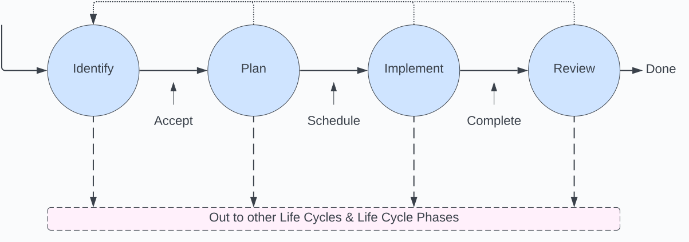

# System Pre-Launch
The initial creation, setup, or installation of the system is contained within the Pre-Launch phase, and covers all system development activity up to the Launch transition into the Operational Phase.

The Pre-Launch phase is comprised of 4 distinct steps, Identify, Plan, Implement, and Review. Each of these steps is meant to be completed sequentially for each item that identified, and it is expected that items will be recursively broken down into sub-items, where each sub-item (and its sub-items) will also flow through each of the 4 steps mentioned above. Also note that there is no requirement that a single "meta-item" or "root-item" be identified that all items must be tied to. These 4 steps and the methodology laid out here is intended to add structure and observability to the process, and it is not intended to suggest that this is a fully linear process proceeding once from Identify, Plan, Implement, and Review out through launch and into the Operation Phase.

> This phase should be kept as short as possible. TODO link to / go over reasons why you want to ship quickly and iterate from there.

# Steps and Transitions
What follows is a description of each step and transition, including the major focus' and relevant activities and outcomes for each step, focus, and transition.

## Identify
Identify, Classify, and Justify items that impact the system.

TODO High Level Description

### Identify
Identify items that impact the system.
TODO mention MVP/MVS
### Classify
Classify the item.
### Justify
Justify the need to address the item.
TODO mention MVP/MVS

## Identified

## Plan
Plan, Collaborate, and Prioritize

### Plan
Plan how to address the item
### Collaborate
Collaborate with others on the plan
### Prioritize
Prioritize the timing of the plan

## Planned

## Implement
Implement, Verify, and Communicate

### Implement
Implement the plan
### Verify
Verify the plan was implemented correctly (and has no unwanted side effects)
### Communicate
Communicate the state of the implementation

## Implemented (AKA Done)

## Review
Review, Validate, and Act

### Review
Review the item, plan, and implementation
### Validate
Validate that the implemented plan resolves the identified item
### Act
Act on any findings

## Reviewed/Complete

