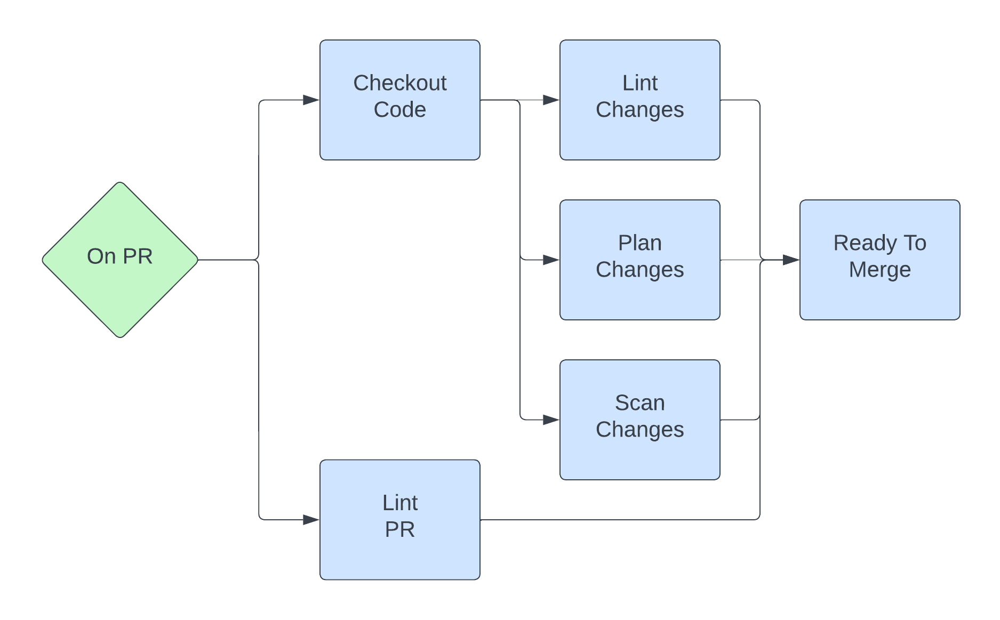
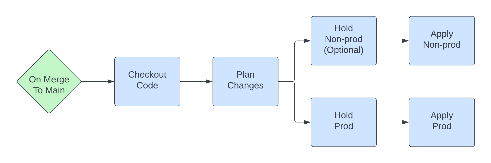

# General
* Always squash merge w/ commit message pulled from the PR title
    * Use https://www.conventionalcommits.org/
    * `<type>[optional scope][!]: <description>` (i.e. `fix(PROJ-1234)!: breaking fix that ...`
    * The set of types and scopes should be agreed upon and encoded in the linter
    * Scope should consistently be the ticket number if an external ticketing system is used (i.e. Jira)
    * Use `!` for breaking changes
    * Body should be additional info that adds context (why) to the change
* Use a single main branch and protect that branch
    * Require PR to merge
    * Require reviews (optionally from code owners)
    * No force pushes (even from administrators)

# Web App or API
The typical development flow for a Web App or API is to create short-lived feature branches, create and validate new functionality, and then deploy those changes out to production. Because versioning from a consumer perspective is usually inherent in the app or API itself, there is usually no need to provide strict versioning or long lived versions for these types of projects. As such the focus is on simplicity and speed, with the ability to understand what is deployed where at any given time.

## Tagging/Versioning, or why not use semver?
When deploying code that backs a web app and/or API, the deployed version information is for reference or internal use only. There is no information within semver that the party using the web app or api needs to know. The API contract itself handles versioning, and a web app does not gain anything by using semver over a release notes page. And what does a sever minor version bump even mean in a web app? Based on this it typically isn't worth the rigamorole of trying to do wemver, especially if you are continuiously deploying when changes hit master. It just adds complexity to the SDLC process (calculating/setting/tracking/incrementing the version) for the App/API without any major advantages. As such, use either the git has of the commit directly (`a5ad1258...`, either first 7 chars or the entire hash) since it provides the ability to know the exact code deployed by referencing git (the source of truth), or a combination of the git hash and build date (`2023-01-01-a5ad1258...`) to allow DevSecOps to easily see the build date and to also get a reference to the exact code.

## Workflows
The following workflows provide a basic CI/CD system for Web Apps and APIs.

### On PR

* Checkout Code
    * Checkout branch under PR
* Lint Code
    * Lint code and fail when linter fails
    * (Optional) Update PR with lint results
* Test Code
   * Execute whichever tests build enough confidence to merge and deploy
   * Evaluate test coverage and fail if coverage is below desired levels
   * (Optional) Update PR with test results
* Scan Code
   * Scan code for security issues (SAST) and fail if severe issues are found
   * (Optional) Update PR with scan results
* Lint PR
    * Lint PR Title and fail if it does not match conventional commit syntax
    * (Optional) Evaluate the PR Description and fail if it does not contain required items
    * (Optional) Update PR with results
* Ready to Merge
    * Only passes if all other jobs pass. This is used to simplify branch protection so there is a single job required to pass before a PR is merged
    * (Optional) Post results to internal chat/email system

### On Merge To Main

* Checkout Code
    * Checkout main branch
* Build Code
    * Build code/container with production settings/flags
    * (Optional) Embed the version as git hash w/ optional date
* Test Build
    * Start the built code/container and run a smoke test
    * (Optional) Run an e2e suite against the locally running build
* Push Build
    * Tag with latest and version as git hash w/ optional date
    * (Optional) Push latest OpenAPI spec or other documentation
* Deploy Non-Prod
    * Update non-prod infrastructure to run the latest code (ideally using blue/green)
    * (Optional) Mark deployment in Observability System
    * (Optional) Post results to internal chat/email system
* Test Non-Prod
    * Execute smoke tests and/or e2e test suite and notify/rollback/fail if tests fail
    * (Optional) Execute security scans (DAST) and notify/rollback/fail if scans fail
    * (Optional) Post results to internal chat/email system
* Deploy Prod (if Continuously Deployed)
    * Update prod infrastructure to run the latest code (ideally using blue/green)
    * (Optional) Mark deployment in Observability System
    * (Optional) Post results to internal chat/email system
* Test Prod (if Continuously Deployed)
   * Execute smoke tests and/or e2e test suite and notify/rollback/fail if tests fail
   * (Optional) Post results to internal chat/email system

### On Manual Deploy

* Checkout Code
    * Checkout main branch
* Check Build
    * Validate inputs (hash/tag, env)
    * Ensure build was tagged/pushed
* Deploy (Non-Prod | Prod)
    * Update infrastructure to run the latest code (ideally using blue/green)
    * (Optional) Mark deployment in Observability System
    * (Optional) Post results to internal chat/email system
* Test (Non-Prod | Prod)
    * Execute smoke tests and/or e2e test suite and notify/rollback/fail if tests fail
    * (Optional) Execute security scans (DAST) and notify/rollback/fail if scans fail
    * (Optional) Post results to internal chat/email system

### On CRON (Optional)
* E2E/Smoke Tests (Optional)
    * (Optional) Execute smoke tests and/or e2e test suite and notify if tests failure
* Security Scan (Optional)
    * (Optional) Execute security scans (DAST/SAST) and notify if scans fail
* Dependency Scan (Optional)
    * (Optional) Execute a code dependency scan and notify/submit PR for outdated/insecure dependencies

# Infrastructure
The typical development flow for infrastructure as code changes is to create short-lived feature branches, create and validate new functionality, and then deploy those changes out to production. Because the purpose is to keep infrastructure changes up to date with the main branch, there is no need for versioning information (especially since infrastructure changes can happen outside of infrastructure as code changes). Note that this section uses terraform-like semantics and nomenclature, but the workflow steps can also apply to other forms of managing infrastructure as code.

## Workflows
The following workflows provide a basic CI/CD system for Web Apps and APIs.

### On PR:

* Checkout Code
    * Checkout branch under PR
* Lint Changes
    * Lint changes and fail when linter fails
    * (Optional) Update PR with lint results
* Plan Changes
    * Run a plan for all environments based on the changes
    * (Optional) Update PR with plan results
* Scan Changes (Optional)
    * (Optional) Run a security scan on the changes
    * (Optional) Run a cost analysis scan on the changes
    * (Optional) Run an allowed configuration scan on the changes
    * (Optional) Update PR with scan results
* Lint PR
    * Lint PR Title and fail if it does not match conventional commit syntax
    * (Optional) Evaluate the PR Description and fail if it does not contain required items
    * (Optional) Update PR with results
* Ready to Merge
    * Only passes if all other jobs pass. This is used to simplify branch protection so there is a single job required to pass before a PR is merged
    * (Optional) Post results to internal chat/email system

### On Merge To Main:

* Checkout Code
    * Checkout main branch
* Plan Change
    * Run a plan for all environments based on the changes (which will catch any infrastructure changes made out of band and show the latest)
* Hold Non-Prod (Optional)
    * (Optional) Wait for confirmation before applying non-production changes
* Apply Non-Prod
    * Apply all non-production changes
    * (Optional) Post results to internal chat/email system
* Hold Prod (Recommended)
    * Wait for confirmation before applying production changes
* Apply Prod
    * Apply all production changes
    * (Optional) Post results to internal chat/email system

### On CRON (Optional)
* Drift Scan (Optional)
    * (Optional) Run a plan to detect infrastructure drift or unapplied changes
* Security Scan (Optional)
    * (Optional) Run a security scan on the changes
* Cost Scan (Optional)
    * (Optional) Run a cost analysis scan on the changes
* Allowed Config Scan (Optional)
    * (Optional) Run an allowed configuration scan on the changes
* Dependency Scan (Optional)
    * (Optional) Execute a code dependency scan and notify/submit PR for outdated/insecure dependencies

# Library or Long-Lived Releases
For libraries or long lived releases (releases where there is the need to support more than a single line of releases) there is the need to convey compatibility information to consumers. [Semver](https://semver.org/) works well for this purpose, and official "releases" can be tagged with a semantic version.

### On PR
* Checkout Code
    * Checkout branch under PR
* Lint Code
    * Lint code and fail when linter fails
    * (Optional) Update PR with lint results
* Test Code
   * Execute whichever tests build enough confidence to merge and deploy
   * Evaluate test coverage and fail if coverage is below desired levels
   * (Optional) If not a breaking change, checkout and run the main branch's tests against this branch's code to ensure backward compatibility
   * (Optional) Update PR with test results
* Scan Code
   * Scan code for security issues (SAST) and fail if severe issues are found
   * (Optional) Update PR with scan results
* Lint PR
    * Lint PR Title and fail if it does not match conventional commit syntax
    * (Optional) Evaluate the PR Description and fail if it does not contain required items
    * (Optional) Update PR with results
* Ready to Merge
    * Only passes if all other jobs pass. This is used to simplify branch protection so there is a single job required to pass before a PR is merged
    * (Optional) Post results to internal chat/email system

### On Merge To Main:
* Checkout Code
    * Checkout main branch
* Auto Release (Optional)
    * Calculate semver version based on the diff between now and the prior tag
    * Set semver version info in code and/or documentation
    * Update Change Log
    * Commit changes to main (skipping ci so Auto Release doesn't run again)
    * Git Tag with version

### On Manual Release
* Checkout Code
    * Check out release branch and/or commit
* Check Branch
    * Ensure on a releaseable branch
* Calculate Version (Optional)
    * Calculate semver version based on the diff between now and the prior tag
* Release
    * Get semver version from input or use calculated version
    * Set semver version info in code and/or documentation
    * Update Change Log
    * Commit changes to main (skipping ci so Auto Release doesn't run again)
    * Git Tag with version

### On Tag
* Checkout Code
    * Check out tag
* Build Code
    * Build code/container with production settings/flags
    * (Optional) Embed the semver version
* Test Build
    * Start the built code/container and run a smoke test
    * (Optional) Run an e2e suite against the locally running build
* Push Build
    * Tag with latest and version as git hash w/ optional date
    * (Optional) Push latest OpenAPI spec or other documentation
* Auto Deploy (Optional)
    * (Optional) Run `On Manual Deploy` for Non-Prod
    * (Optional) Run `On Manual Deploy` for Prod

### On Manual Deploy
* Checkout Code
    * Checkout main branch
* Check Build
    * Validate inputs (tag, env)
    * Ensure build was tagged/pushed
* Deploy (Non-Prod | Prod)
    * Update infrastructure to run the latest code (ideally using blue/green)
    * (Optional) Mark deployment in Observability System
    * (Optional) Post results to internal chat/email system
* Test (Non-Prod | Prod)
    * Execute smoke tests and/or e2e test suite and notify/rollback/fail if tests fail
    * (Optional) Execute security scans (DAST) and notify/rollback/fail if scans fail
    * (Optional) Post results to internal chat/email system

### On CRON (Optional)
* E2E/Smoke Tests (Optional)
    * (Optional) Execute smoke tests and/or e2e test suite and notify if tests failure
* Security Scan (Optional)
    * (Optional) Execute security scans (DAST/SAST) and notify if scans fail
* Dependency Scan (Optional)
    * (Optional) Execute a code dependency scan and notify/submit PR for outdated/insecure dependencies
