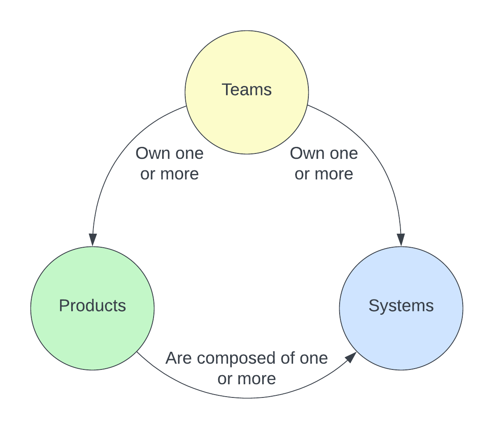

# Software Development Life Cycle
Not to be confused with a System Life Cycle.

# Team Structure
This SDLC assumes the following team structure

* The company is organized into cross-functional teams
* Teams are staffed based on the products/systems they own and their scope/charter
* Teams directly own internal/external products (or clearly defined product sections/areas)
* Every product (and product section/area) is owned by a single team (See "Ownership/Stewardship")
* Teams directly own internal/external systems
* Every system is owned by a single team (See "Ownership/Stewardship" document)

# Overview
Opportunity/Problem SDLC

TODO image

