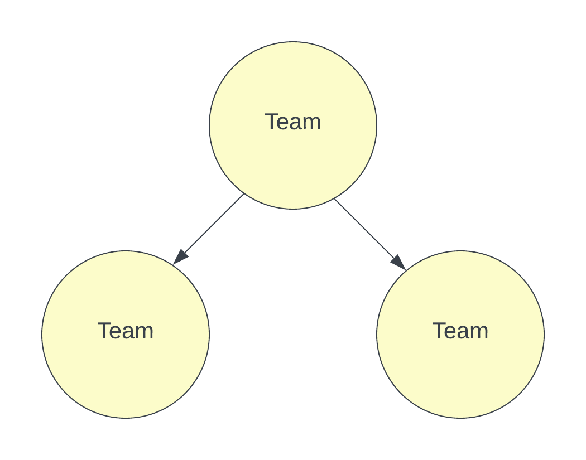
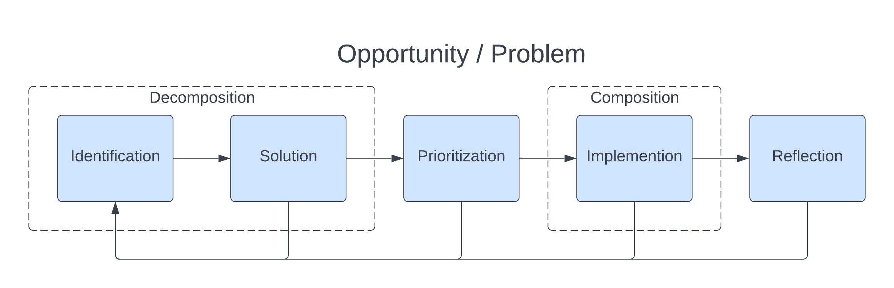

# Software Development Life Cycle
Not to be confused with a System Life Cycle.

The Software Development Life Cycle (SDLC) is ...

# Team Structure
This SDLC assumes the following team structure and ownership.

|  |  |
| --- | --- |

* The company is organized into cross-functional teams
* Teams are staffed based on the products/systems they own and their scope/charter
* Teams directly own internal/external products (or clearly defined product sections/areas)
* Every product (and product section/area) is owned by a single team (See "Ownership/Stewardship")
* Teams directly own internal/external systems
* Every system is owned by a single team (See "Ownership/Stewardship" document)

# Overview
Opportunity/Problem Solution (OPS?) SDLC

TODO classify Item as analagous to an instance of an opportunity/problem

There is a single general process used for all items that go through each stage of the SDLC. First, an opportunity or problem is identified and determined to be worth solving. Next a solution is crafted and determined to be ready for implementation. Then the opportunity/problem solution is prioritized against all other opportunity/problem solutions and scheduled. Then the opportunity/problem solution enters implementation and is considered complete when released. Finally, the item and the process it went through is reflected upon. At each of these stages additional opportunities/problems may be identified, and the identified opportunity/problem follows the same process.

There are two additional areas marked as "decomposition" and "composition". As the actual size of a given opportunity/problem does not always match the desired size a team or individual would like to work at, opportunities and problems frequenctly undergo decomposition in a tight identify/solve loop. This loop decomposes an opportunity or problem by breaking down a solution into smaller and smaller items until an optimal size of item has been reached. See Decomposition for further information TODO link. Compisition is the opposite, where the items are recomposed into the full solution created to solve the original opportunity/problem identified.

Processes and controls within the SDLC are mapped to Stage/Type combinations (todo more here), meaning that a process or control takes effect when a particular type of item hits a certain stage in the SDLC.

# Identification

# Solution

## Decomposition

# Prioritization

# Implementation

## Composition

# Reflection

# Definitions
* Composition - TODO
* Control - TODO
* Decomposition - TODO
* Item - a generic name for an opportunity or problem
* Process - TODO
* Stage - a part of the sdlc
* Type - A type or classification of an item at a particular stage of the SDLC
