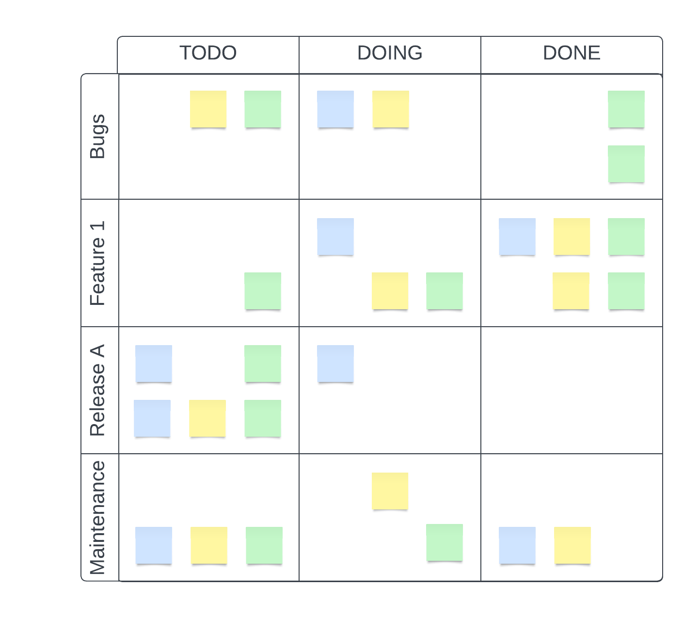

# The Board
Tracking tasks on "the board" is ubiquitous in software development. As such, it can often be overlooked or misunderstood.

Note: This is focused on cross-functional teams. For homogeneous teams this is most likely going to be the wrong approach.

## Purpose
How you view and track your tickets is important, because it determines what you focus on and prioritize as a team.

### Daily Standup
There are two main options here: person centric or project/release centric. It is very common to "go around the room" and have everyone report what they are doing. IMO that can work well for teams where the focus is on getting individuals to be responsible for their work and to elicit issues, problems, or blockers for the individual. In that case "walking the board" person by person would probably be best. But while this focus on each person can be good, what often happens is that it focuses on the person at the cost of the team and team objectives.

An alternative is to "walk the board" feature by feature, project by project, initiative by initiative, or release by release. This focuses the team on what the team is trying to accomplish, and also puts a focus on the overall priorities.

The tickets in the TODO list (whether Kanban or Sprint) are supposed to be in priority order, and there is usually one master list that a defined role is supposed to keep in order. But on cross-functional teams this order is often obscured by dependency chains and team member/specialty availability.

A hypothetical example of allowing a customer to specify the default number of items to show in a list by storing the desired number in a per-user setting. The tasks that might be needed to do this are (in a rough order):
* The UX designs on where the setting lives and how it is managed (placement, wording, min/max/error messaging, etc)
* A technical decision on where this setting will be stored, what DB/API changes are needed, etc
* A schema migration to add another field or enum to the database where the settings are stored
* An API update to allow retrieving and storing the setting
* API updates to respect the setting when retrieving items
* UI changes to implement the management of the setting
* Verification work to ensure everything works as expected (either manual or automated)
* Other tasks as required by the product(s) and/or system(s) affected

As you can see from the list above there are several soft and hard dependencies in just that one feature addition. And for teams where there are different people with different specialties, it is often the case that multiple people will need to work together to accomplish the goal.

You often want to track and set the priority of items at a higher, more meaningful level than managing the priority of tasks like P1 - schema migration, P2 - API Endpoint to write setting, P2 - API endpoint to read setting, etc...

A good way to do this is prioritize features or discrete bodies of work into "swimlanes", and then manage the dependency chains as an explicit priority within the swimlane itself. Then when you walk the board you go feature by feature in priority order, focusing on the releasable items being worked on by the team instead of focusing on the items being worked on by each individual. Note that as you go item by item you should end up with each individual giving the same information they gave before. And then afterwards you can have a general statement of "anything else" to catch items that may not be tracked (such as out of office reminders, personal items, etc..)