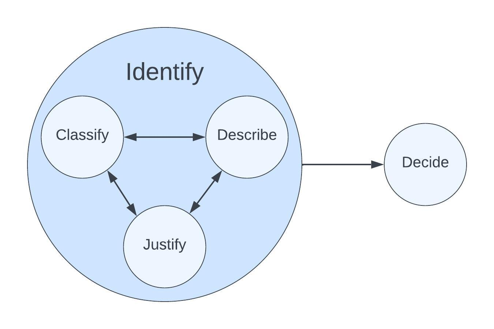

# Software Development Life Cycle
Also known as the Software Development Process.
Not to be confused with a System Life Cycle.

# Background

## Organization Structure
## Team Structure
This SDLC assumes the following team structure and ownership.

|  |  |
| --- | --- |

* The company is organized into cross-functional teams
* Teams are staffed based on the products/systems they own and their scope/charter
* Teams directly own internal/external products (or clearly defined product sections/areas)
* Every product (and product section/area) is owned by a single team (See "Ownership/Stewardship")
* Teams directly own internal/external systems
* Every system is owned by a single team (See "Ownership/Stewardship" document)
## Goals and Assumptions

# Overview

Opportunity - Possibility of gaining some benefit
Problem - Unwelcome/harmful situation
Risk - Possibility of some loss

TODO Basic overview
TODO Define item
TODO Link to Item Classification Types

### What, Why, How, Where, Who, When

Another way to look the SDLC is to view it through the lense of answering what, why, who, how, and when.

In essence, each stage of the SDLC seeks to answer these questions prior to implementation, and then to reflect on those questions after implementation is complete.

# Components
The SDLC is made up of the following components:

## Identify
Identify items that should be addressed.

**Related Activities**:
* Ad hoc
* &lt;Product&gt; Direction
* &lt;System&gt; Direction

### Classify

**Purpose**: To classify the item within the SDLC so that type-specific requirements, activities, and artifacts can be tracked.

**Outcome**: A type has been assigned to the item.

### Describe

**Purpose**: To describe _what_ the item is to a degree sufficient that a justification of why this item should be addressed can be made and that a plan can be created to resolve this item.

**Outcome**: A sufficiently articulated description of _what_ this item is.

### Justify

**Purpose**: Justify _why_ the item as described should be addressed by the tem and prioritized for planning and implementation.

**Outcome**: An explanation of _why_ this item should be addressed.

### Decide

**Purpose**: To decide if this item should move forward into the planning phase (after applicable review and approval based on item type)

**Outcome**: A record of the decision to either move this item to planning or to retire/archive/not proceed 

## Plan
Plan how to address items that have been identified.

**Related Activities**:
* &lt;Item&gt; Breakdown (planning)

### Formulate

**Purpose**: To formulate a plan of _how_ to address the item identified earlier.

**Outcome**: A plan that addresses _how_ to address the item identified earlier.

### Collaborate

**Purpose**: To collaborate on the plan with _who_ needs to review/approve/know/etc.

**Outcome**: An understanding by those affected and invested in the item/product(s)/system(s) of what the plan is and its relative priority.

### Prioritize

**Purpose**: To prioritize the item for implementation _when_ it makes sense to do so given all other item priorities.

**Outcome**: A recorded relative priority of this item in relation to other items.

### Decide

**Purpose**: To decide if and when the plan will be implemented, and by whom.

**Outcome**: A record of the decision to either move this item to implementation or to retire/archive/not proceed.

## Execute
Execute plans to address items. A plan is not executed until it has been implemented, validated, and communicated.

**Related Activities**:
* &lt;Item&gt; Breakdown (planning)

### Implement

**Purpose**: To implement the plan

**Outcome**: TODO

### Validate

**Purpose**: To validate the implementation of the plan

**Outcome**: TODO

### Communicate

**Purpose**: To communicate the implementation of the plan

**Outcome**: TODO

### Decide

**Purpose**: TODO

**Outcome**: TODO

## Reflect
Reflect on implemented items.

### Review

**Purpose**: TODO

**Outcome**: TODO

### Act

**Purpose**: TODO

**Outcome**: TODO

### Decide

**Purpose**: TODO

**Outcome**: TODO

# Item Types
There are multiple ways to classify items within the SDLC, and the types and hierarchy can be tailored to an org as needed.

Item types are important, as processes and requirements within the SDLC can be "hooked" onto the type of item after classification.

## Item Type Hierarchy
1. Strategy
1. Initiative
1. Milestone/Epic
1. Task/Bug/Vulnerability
1. Sub-Task

## Types

### Strategy
High-level organizational grouping to direct focus and provide direction

### Initiative
Multiple Teams/Products/systems, or Multiple Epics

### Milestone
A group of work tracked as a releasable set of items

### Epic
Single Team/Product/System, Multiple Tasks

### Task
Item that can be completed in a reasonable amount of time, Basic unit of work

### Bug
A defect within a system or product

### Vulnerability
An exploitable defect within a system

### Sub-Task
Components of a Task

# Activities
These activities drive the SDLC. Some are best done synchronously, but where possible a bias towards asynchronous work, communication, and documentation is preferred.

The following activites are loosely arranged by SDLC phase

## Identify

### Organizational Strategy

### Product Direction

### System Direction

## Plan

## Execute

## Reflect
